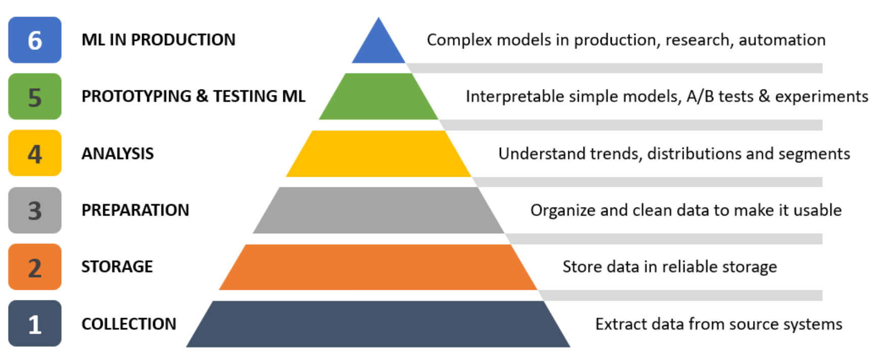

## Machine Learning and Data Pyramid

ML uses data to:

1.  **Draw causal insights**: Answering "Why?" (e.g., Why are customers canceling subscriptions?).
2.  **Predict future events**: Identifying likely outcomes (e.g., Which customers are likely to cancel?).
3.  **Understand patterns in data**: Discovering groupings or trends (e.g., Customer segmentation for targeted marketing).

---

## Data Hierarchy of Needs (Data Pyramid) 

This pyramid outlines the prioritized stages of data utilization:

1.  **Collection**: Gathering required data through infrastructure and systems.
2.  **Storage**: Investing in reliable and accessible data storage.
3.  **Preparation**: Cleaning and organizing data (e.g., outlier detection, ensuring data quality) to reflect reality.
4.  **Analysis**: Understanding business trends through dashboards, scorecards, and in-depth analyses (e.g., cohort analysis, distribution insights).
5.  **Model Prototyping & Testing**: Building ML models to gain causal insights, predict outputs, and run experiments to validate their actionability (e.g., testing a churn prediction model with retention campaigns).
6.  **ML in Production**: Automating and deploying tested and confirmed ML models into systems like CRM, websites, and mobile apps.

---

**Key Takeaway**: The first three steps (Collection, Storage, Preparation) are foundational; failures here lead to "garbage in, garbage out," rendering even sophisticated ML models incorrect and potentially causing costly mistakes.

## Machine Learning Principles

**Machine Learning (ML) Goal**: Applying statistical and computer science methods to data to:
1.  Draw causal insights.
2.  Predict future events.
3.  Understand patterns in data.

---

### Key ML Types:

1.  **Supervised Machine Learning**:
    * **Core Idea**: Uses a **target variable** (what you want to predict) to guide the model. The model learns from data where the "answer" (target) is known.
    * **Data Structure**:
        * **Target Variable**: The specific outcome the model aims to predict (e.g., probability of a transaction being fraudulent).
        * **Input Features**: Data points/columns used to make the prediction (e.g., past fraud count, transaction time, amount).
    * **Process**: Uses input features to predict the target variable.
    * **Examples**:
        * Predicting if a transaction is fraudulent.
        * Predicting which customers will purchase next month.
        * Predicting if a manufactured item is faulty.

2.  **Unsupervised Machine Learning**:
    * **Core Idea**: Works with data that **does not have a target variable**. The model finds inherent structures or patterns.
    * **Data Structure**: Only **input features**.
    * **Process**: Identifies groups of similar observations or anomalies.
    * **Examples**:
        * Customer segmentation (grouping similar customers).
        * Segmenting transactions based on amount, currency, etc.
        * Anomaly detection in manufacturing sensor data.

---

### ML Applications - Examples:

* **Marketing**:
    * **Supervised**: Predicting next month's purchasers, customer lifetime value.
    * **Unsupervised**: Customer segmentation.
* **Finance**:
    * **Supervised**: Identifying transaction attributes predictive of fraud, predicting mortgage defaults.
    * **Unsupervised**: Segmenting transactions (profitable, risky, money-losing).
* **Manufacturing**:
    * **Supervised**: Predicting faulty items (quality control), predicting machine breakdowns (predictive maintenance via sensor data).
    * **Unsupervised**: Anomaly detection in equipment sensor readings to identify potential malfunctions.
* **Transportation**:
    * **Supervised**: Predicting parcel delivery time, predicting weekly demand.
    * (Often involves optimization, which can be related to ML): Identifying the fastest delivery route.

---

**Note**: The first two ML goals (causal insights and prediction) generally fall under **supervised learning**, while the third (understanding patterns) is typically addressed by **unsupervised learning**.

## Job Roles, Tools & Technologies

**Understanding data roles and team structures is crucial for business leaders to effectively engage with their data science departments.**

**Data Roles Aligned with the Data Needs Pyramid:**

1.  **Data Collection:**
    * **Role:** Infrastructure Owners (primarily Software and System Engineers).
    * **Responsibility:** Maintain and develop data-generating systems (websites, machinery, applications, etc.).

2.  **Data Storage:**
    * **Role:** Data Engineers (including specializations like Database Administrators and Data Pipeline Engineers), sometimes Software Developers.
    * **Responsibility:** Build data pipelines, ensure reliable and accessible data storage, and enable data access for other teams.

3.  **Data Preparation & Cleaning:**
    * **Roles:** Shared by Data Engineers and Data Analysts.
    * **Responsibilities:**
        * Data Engineers: Data quality assurance.
        * Data Analysts: Preparing usable datasets, aggregation for reporting and analysis.

4.  **Data Analysis:**
    * **Roles:** Data Analysts and Data Scientists.
    * **Responsibilities:**
        * Data Analysts: Create dashboards, scorecards, perform ad-hoc/deep-dive analyses, build self-service tools.
        * Data Scientists: Analyze trends and distributions, apply statistical and ML methods to find patterns and significant signals not evident through simple analysis.

5.  **Model Prototyping, Testing & Production (Machine Learning):**
    * **Roles:** Machine Learning (ML) Engineers and Data Scientists.
    * **Responsibilities:**
        * ML Engineers: Work with Data Scientists to test models and deploy them into production systems (CRM, apps). Typically build models from scratch for production.
        * Data Scientists: Focus on experimentation and prototyping for new business questions.
    * **Distinction (Rule of Thumb):**
        * Building models from scratch for production: ML Engineer.
        * Experimentation and prototyping for new business questions: Data Scientist.

**Data Team Structures:**

There are three main operating models for organizing a data function:

1.  **Centralized Model:**
    * **Description:** All data functions reside in one central team.
    * **Suited for:** Small companies, startups, new organizations (ensures consistency and focus).
    * **Challenge:** Does not scale well with business growth and complexity.

2.  **Decentralized Model:**
    * **Description:** Each business unit has its own dedicated data function.
    * **Suited for:** Larger organizations.
    * **Challenges:** Can lead to silos, lack of company-wide data governance, and duplicated efforts.

3.  **Hybrid Model (Often considered best):**
    * **Description:** Combines aspects of both centralized and decentralized models.
    * **Structure:**
        * **Centralized:** Critical functions like data governance, methodology, and tooling.
        * **Decentralized:** Application of tools and methodologies for prototyping, business analysis, model building, and A/B testing within business units.
    * **Benefit:** Utilizes the advantages of both models.